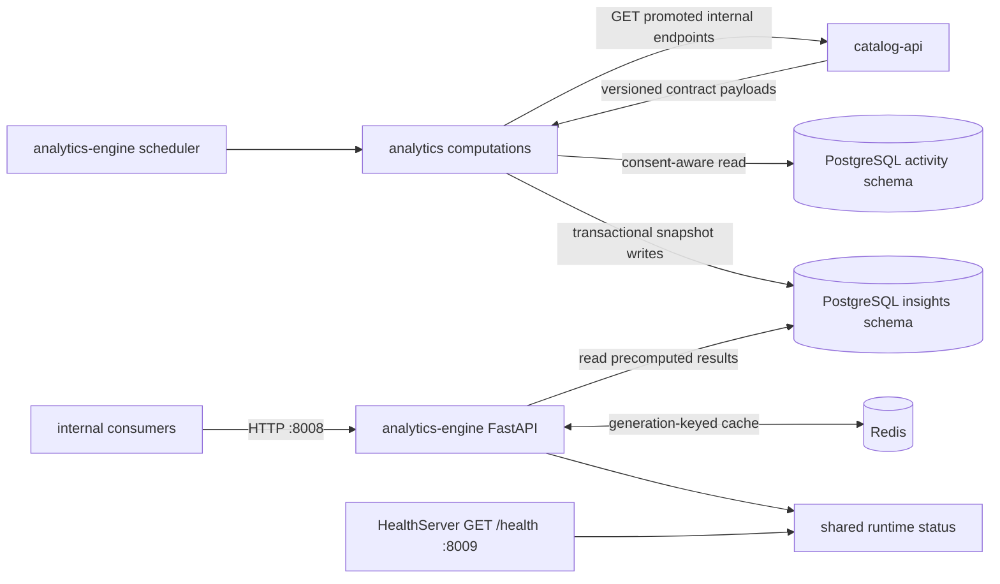

# Analytics-engine architecture

The analytics engine turns expensive catalog and graph queries into scheduled, read-optimized results. It communicates with `catalog-api` over a promoted internal HTTP contract and does not connect to Neo4j directly.

## Repository boundary

The promoted contract at [`contracts/catalog-api/internal-insights/v1/`](../contracts/catalog-api/internal-insights/v1/) fixes contract version `1.1.0`, the `catalog-api` producer repository and commit, the OpenAPI digest, and the generated Python binding digest. [`source.json`](../contracts/catalog-api/internal-insights/v1/source.json) is the provenance record; `just contract-check` verifies its digests and version against [`openapi.yaml`](../contracts/catalog-api/internal-insights/v1/openapi.yaml) and [`insights/catalog_api_contract.py`](../insights/catalog_api_contract.py). Database definitions remain in `database-schema`; shared connection and health primitives remain in `python-libraries`.

The promoted OpenAPI document is the authority for the producer transport. This table maps that boundary to the engine's stable computation keys and read model without duplicating request or response schemas:

| Computation key | `catalog-api` input path | Local effect | Read endpoint on `:8008` |
| --- | --- | --- | --- |
| `artist_centrality` | `/api/internal/insights/artist-centrality` | `insights.artist_centrality` | `/api/insights/top-artists` |
| `genre_trends` | `/api/internal/insights/genre-trends` | `insights.genre_trends` | `/api/insights/genre-trends` |
| `label_longevity` | `/api/internal/insights/label-longevity` | `insights.label_longevity` | `/api/insights/label-longevity` |
| `anniversaries` | `/api/internal/insights/anniversaries` | `insights.monthly_anniversaries` | `/api/insights/this-month` |
| `data_completeness` | `/api/internal/insights/data-completeness` | `insights.data_completeness` | `/api/insights/data-completeness` |
| `community_enrichment` | `/api/internal/insights/community-enrichment` | Triggers the producer-owned bounded enrichment batch | No dedicated read endpoint |
| `release_rarity` | `/api/internal/insights/rarity-scores` | `insights.release_rarity` | `/api/insights/release-rarity` |
| `activity_summary` | None — reads `activity.events` and `activity.impressions` directly | `insights.activity_summary` | `/api/insights/activity-summary` |

`/api/insights/status` reads the latest `insights.computation_log` row for all eight computation keys. `/health` is also available on the FastAPI port; the independently served readiness probe is `GET /health` on port 8009.

## Scheduled precomputation

The scheduler waits 30 seconds after startup, then runs artist centrality, genre trends, label longevity, monthly anniversaries, data completeness, community enrichment, release rarity, and the activity summary sequentially. Each computation has an endpoint-specific HTTP read budget and records `completed` or `failed` in `insights.computation_log`. A failed computation does not prevent later computations from running. Non-empty result sets replace their corresponding rows transactionally; an empty producer result leaves the previous snapshot intact. Community enrichment is a producer-side operation and records its returned `enriched` count rather than writing a result table here. The activity summary is the one exception to the empty-result rule and rewrites its window either way, for the reason given below.

The next cycle begins one configured interval after the preceding cycle started (or immediately if a cycle outlasts the interval). Precomputation is deliberate: expensive graph aggregation occurs on a schedule, while read endpoints perform bounded PostgreSQL queries. This separates computation latency from request latency and gives operators a durable status record for each computation.

## Activity summary and the consent filter

The activity summary is the one computation whose input is PostgreSQL rather than `catalog-api`. It reads the first-party behavioural tables ADR 0010 defines — `activity.events` and `activity.impressions` — and records, per UTC day, how many events of each type occurred and how many distinct subjects produced them, and how many impressions each ranking policy served together with the distinct subjects and candidate sets behind them. Operators can see that events and impressions are flowing, by type and by policy, without reading a raw behavioural row.

Every read goes through [`insights/activity.py`](../insights/activity.py), which is the only place in this service that touches the `activity` schema. ADR 0010 enforces consent twice and says neither check replaces the other, so that module applies both: the row's write-time `consent_purposes` snapshot, which records what was permitted when the row was written, and a re-check against `activity.consent_grants`, which enforces what is permitted now. `training_eligible_subjects` is the second check; `read_events` and `read_impressions` compute it themselves rather than accepting a subject set from the caller, and their optional `subjects` argument narrows that set rather than replacing it, so no call shape reaches a subject the grant table does not currently allow. The module issues no `INSERT`, `UPDATE`, or `DELETE`, and never selects a user id — only the pseudonymous `subject_id` leaves it.

Both reads are bounded half-open on `occurred_at`, because both tables are `PARTITION BY RANGE (occurred_at)` and the bound is what lets the planner prune to the months actually asked for. Within that bound they are keyset-paged on the tables' own primary keys, `(occurred_at, event_id)` and `(occurred_at, impression_id)`.

The summary filters on the `product_analytics` purpose. Counting what happened is product analytics; a subject who consented to model training has not thereby consented to being counted here, and a training reader filters on `model_training` instead. Each run rewrites the whole window it covers, including when that window summarises nothing. This differs deliberately from the catalog-derived computations, which leave the previous snapshot intact on an empty producer result: an empty result there means the producer had nothing to say, while an empty result here can mean a subject revoked consent, and the previous run's counts for that subject must not survive it.

`insights.activity_summary` is declared in `database-schema` like every other `insights.*` table; this repository holds no DDL. `tests/test_activity_summary.py` carries the table definition as the filed follow-on and fails if a `CREATE TABLE` is introduced here instead.

## Cache consistency

Redis is a cache-aside optimization, not the source of truth. Every cached key belongs to a monotonically increasing generation. A request captures the current generation before reading PostgreSQL and writes only to that generation. After `run_all_computations` returns—even when it isolated one or more per-computation failures—the scheduler advances the generation and reclaims superseded generation keys. A request that straddles a recomputation therefore cannot make stale data visible in the new generation.

If Redis is unavailable, endpoints continue reading PostgreSQL. The failed Redis client is closed before its reference is discarded so startup degradation does not leak a connection pool.

## Release-rarity computation

Release rarity combines catalog and community signals into a normalized score and category. Community have/want counts are stored with the other precomputed inputs, and missing signals are handled explicitly rather than silently treated as complete observations. The read API serves the stored result; it does not recompute rarity during a request.

Per ADR 0007, the score is media-neutral: `medium_rarity` is the canonical-medium signal that every release carries, `media_families` records the ADR 0007 family ids the release covers, and `family_signals` carries per-family-extension scores, keyed by module id (for example `grooved`) to a mapping of signal name to score. `pressing_scarcity` is a grooved-only signal populated only for vinyl, shellac, and grooved-other releases; it is `null` for every other family. `format_rarity` is retained for one minor version as a deprecated alias, computed at weight `0.0` and superseded by `medium_rarity`.

## Source identity

Runtime health data, structured logging, the startup banner, outbound `User-Agent`, package metadata, and OCI annotations identify the service as `analytics-engine`. API routes and environment variables retain the established `insights` namespace because those names are versioned wire and configuration interfaces rather than display branding.
