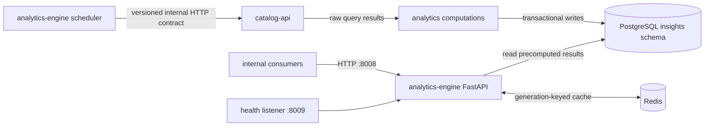

# Analytics-engine architecture

The analytics engine turns expensive catalog and graph queries into scheduled, read-optimized results. It communicates with `catalog-api` over a promoted internal HTTP contract and does not connect to Neo4j directly.

## Repository boundary

The promoted contract at `contracts/catalog-api/internal-insights/v1/` fixes the producer repository, source revision, OpenAPI digest, and generated binding digest. Contract validation prevents either repository from silently changing the interface. Database definitions remain in `database-schema`; shared connection and health primitives remain in `python-libraries`.

## Scheduled precomputation

The scheduler computes artist centrality, genre trends, label longevity, monthly anniversaries, data completeness, community enrichment, and release rarity. Each cycle uses endpoint-specific HTTP timeouts, writes a complete result set transactionally, records computation status, and waits the configured interval before starting again.

Precomputation is deliberate: expensive graph aggregation occurs on a schedule, while read endpoints perform bounded PostgreSQL queries. This separates computation latency from request latency and gives operators a durable status record for each metric family.

## Cache consistency

Redis is a cache-aside optimization, not the source of truth. Every cached key belongs to a monotonically increasing generation. A request captures the current generation before reading PostgreSQL and writes only to that generation. After a successful computation cycle, the scheduler advances the generation and reclaims superseded generation keys. A request that straddles a recomputation therefore cannot make stale data visible in the new generation.

If Redis is unavailable, endpoints continue reading PostgreSQL. The failed Redis client is closed before its reference is discarded so startup degradation does not leak a connection pool.

## Release-rarity computation

Release rarity combines catalog and community signals into a normalized score and category. Community have/want counts are stored with the other precomputed inputs, and missing signals are handled explicitly rather than silently treated as complete observations. The read API serves the stored result; it does not recompute rarity during a request.

## Source identity

Runtime health data, structured logging, the startup banner, outbound `User-Agent`, package metadata, and OCI annotations identify the service as `analytics-engine`. API routes and environment variables retain the established `insights` namespace because those names are versioned wire and configuration interfaces rather than display branding.
