# Analytics-engine operations

## Runtime interfaces

The application listens on port 8008. A lightweight health listener runs on port 8009 and reports the service name, readiness state, timestamp, and last successful computation time.

The outbound client identifies itself as `analytics-engine/<version>` with the canonical repository URL. Calls to the promoted `catalog-api` internal endpoints also include `X-Internal-Secret` when `INSIGHTS_INTERNAL_SECRET` is configured.

## Configuration

| Variable | Required | Purpose |
| --- | --- | --- |
| `POSTGRES_HOST` | yes | PostgreSQL host, optionally including a port |
| `POSTGRES_USERNAME` | yes | PostgreSQL account name or secret-file reference |
| `POSTGRES_PASSWORD` | yes | PostgreSQL password or secret-file reference |
| `POSTGRES_DATABASE` | yes | Database containing the `insights` schema |
| `API_BASE_URL` | no | `catalog-api` base URL; defaults to `http://api:8004` |
| `REDIS_HOST` | no | Redis URL or host used for cache-aside reads |
| `INSIGHTS_INTERNAL_SECRET` | no | Shared secret for internal catalog endpoints |
| `INSIGHTS_SCHEDULE_HOURS` | no | Computation interval; invalid values fall back to 24 hours |
| `INSIGHTS_MILESTONE_YEARS` | no | Comma-separated anniversary milestones |
| `POSTGRES_POOL_MIN_SIZE` | no | Minimum shared PostgreSQL pool size |
| `POSTGRES_POOL_MAX_SIZE` | no | Maximum shared PostgreSQL pool size |
| `LOG_LEVEL` | no | Uvicorn and application log level |

Secrets must be delivered by the deployment layer. Do not place credentials in repository files or image environment instructions.

## Lifecycle

```mermaid
stateDiagram-v2
    [*] --> Starting
    Starting --> Ready: PostgreSQL and catalog client initialized
    Starting --> Degraded: Redis unavailable
    Degraded --> Ready: PostgreSQL remains authoritative
    Ready --> Computing: scheduled interval begins
    Computing --> Ready: results committed and cache generation advanced
    Computing --> Ready: failure recorded; retry waits for next interval
    Ready --> Stopping: shutdown requested
    Degraded --> Stopping: shutdown requested
    Stopping --> [*]: scheduler cancelled and clients closed
```

PostgreSQL and the catalog client are required for readiness. Redis failure disables caching without preventing service startup. Shutdown cancels the scheduler, closes Redis, HTTP, and PostgreSQL resources, then stops the health listener.

## Operator checks

Run `just check` for the authoritative source, test, package, dependency, and release-artifact gate. Run `just image` to build the repository-named image and verify its import, non-root user, repository, license, and exact-revision annotations. Run `just audit` for the current network-backed dependency vulnerability scan.
