# Analytics-engine operations

## Runtime interfaces

The FastAPI application listens on port 8008 and serves the read endpoints documented in [architecture.md](architecture.md#repository-boundary), including `GET /health`. A separate lightweight listener serves `GET /health` on port 8009 for container readiness. Both health responses contain `service`, `status`, `timestamp`, and `last_computation`. The FastAPI route always returns HTTP 200; the readiness listener returns 200 only for `status=healthy` and 503 while the required PostgreSQL pool or catalog client is unavailable. `last_computation` is the completion time of the latest scheduler cycle that returned from the computation coordinator, or `null` before the first such cycle finishes.

The outbound client identifies itself as `analytics-engine/<version>` with the canonical repository URL. Calls to the promoted `catalog-api` internal endpoints also include `X-Internal-Secret` when `INSIGHTS_INTERNAL_SECRET` is configured.

## Configuration

| Variable | Required | Purpose |
| --- | --- | --- |
| `POSTGRES_HOST` | yes | PostgreSQL host, optionally including a port; an embedded port takes precedence over `POSTGRES_PORT` |
| `POSTGRES_PORT` | no | PostgreSQL port when `POSTGRES_HOST` does not include one; defaults to `5432` |
| `POSTGRES_USERNAME` / `POSTGRES_USERNAME_FILE` | yes | PostgreSQL account name; the `_FILE` value takes precedence |
| `POSTGRES_PASSWORD` / `POSTGRES_PASSWORD_FILE` | yes | PostgreSQL password; the `_FILE` value takes precedence |
| `POSTGRES_DATABASE` | yes | Database containing the `insights` schema |
| `API_BASE_URL` | no | `catalog-api` base URL; defaults to `http://api:8004` |
| `REDIS_HOST` | no | Redis hostname, not a URL; defaults to `localhost` |
| `REDIS_PORT` | no | Redis port; defaults to `6379` |
| `REDIS_PASSWORD` / `REDIS_PASSWORD_FILE` | no | Redis password; the `_FILE` value takes precedence and the password is URL-escaped |
| `INSIGHTS_INTERNAL_SECRET` / `INSIGHTS_INTERNAL_SECRET_FILE` | no | Shared secret for internal catalog endpoints; the `_FILE` value takes precedence |
| `INSIGHTS_SCHEDULE_HOURS` | no | Positive integer cycle interval; missing, invalid, zero, and negative values use `24` |
| `INSIGHTS_MILESTONE_YEARS` | no | Comma-separated integer anniversary milestones; values are deduplicated and sorted, and an empty or invalid list uses `25,30,40,50,75,100` |
| `POSTGRES_POOL_MIN_SIZE` | no | Minimum shared PostgreSQL pool size; defaults to `1` and is clamped to the maximum |
| `POSTGRES_POOL_MAX_SIZE` | no | Maximum shared PostgreSQL pool size; defaults to `4`; invalid or non-positive values use the default |
| `LOG_LEVEL` | no | Uvicorn and application log level; defaults to `INFO` |
| `OTEL_EXPORTER_OTLP_ENDPOINT` | no | Collector base URL (for example `http://otel-collector:4318`); unset disables both metrics and trace export |
| `OTEL_EXPORTER_OTLP_METRICS_ENDPOINT` | no | Metrics-only collector override; falls back to `OTEL_EXPORTER_OTLP_ENDPOINT` |
| `OTEL_EXPORTER_OTLP_TRACES_ENDPOINT` | no | Traces-only collector override; falls back to `OTEL_EXPORTER_OTLP_ENDPOINT` |
| `OTEL_METRICS_EXPORTER` | no | `otlp` (default) or `none` to force metrics export off |
| `OTEL_METRIC_EXPORT_INTERVAL` | no | Push interval in milliseconds (SDK default) |
| `OTEL_TRACES_EXPORTER` | no | `otlp` (default) or `none` to force trace export off, leaving metrics untouched |
| `OTEL_TRACES_SAMPLER` | no | Sampler name; defaults to `parentbased_traceidratio` |
| `OTEL_TRACES_SAMPLER_ARG` | no | Sampling ratio; defaults to `1.0` |
| `OTEL_PROPAGATORS` | no | Propagator selection; otherwise W3C TraceContext plus baggage is installed |
| `OTEL_SDK_DISABLED` | no | Standard SDK kill switch; `true` makes configured telemetry a no-op |
| `OTEL_SERVICE_NAME` | no | Overrides the `service.name` resource attribute (`analytics-engine` by default) |
| `OTEL_RESOURCE_ATTRIBUTES` | no | Extra resource attributes, for example `service.namespace=groovemap,deployment.environment.name=dev` |
| `OTEL_SEMCONV_STABILITY_OPT_IN` | no | HTTP semantic-convention selection; defaults to `http` before instrumentation |

Secrets must be delivered by the deployment layer. Do not place credentials in repository files or image environment instructions.

## Telemetry

Metrics and traces are bootstrapped by `groovemap-runtime`'s `common.telemetry` (the `otel` and `otel-http` extras) and pushed over OTLP/HTTP-protobuf — there is no local `/metrics` scrape endpoint. Both signals are configured entirely from the standard environment variables above and independently of each other: `OTEL_TRACES_EXPORTER=none` silences spans while metrics keep flowing, and the reverse holds. With `OTEL_EXPORTER_OTLP_ENDPOINT` unset, every instrument and every span is a local no-op and the service starts and behaves exactly as it does today.

`insights.insights.lifespan` calls `setup_telemetry("analytics-engine")` immediately after `setup_logging`, instruments the FastAPI app and every httpx client, starts the event-loop monitor on its own running loop, and calls `shutdown_telemetry()` on shutdown so the last export of both signals lands.

### Metrics

| Metric | Instrument | Attributes | Emitted from |
| --- | --- | --- | --- |
| `http.server.request.duration` | histogram, s | `http.route`, `http.response.status_code` | inbound FastAPI requests |
| `http.client.request.duration` | histogram, s | `server.address`, `http.response.status_code` | outbound calls to `catalog-api` |
| `db.client.operation.duration` | histogram, s | `db.system.name=postgresql`, `db.operation.name`, and `error.type` on failures | the shared PostgreSQL pool wrapper |
| `groovemap.insights.computation.duration` | histogram, s | `computation`, `outcome=success\|failure` | `run_all_computations`, around each scheduled computation |
| `groovemap.insights.last_success` | observable gauge, unix s | `computation` | in-memory state updated on each successful computation |
| `groovemap.api.cache` | counter | `outcome=hit\|miss`, `cache=insights` | `InsightsCache.get` on every cache-aside read |

### Runtime metrics

`setup_telemetry` installs the process view with no code in this repository; `start_event_loop_monitor()` adds the one signal no instrumentor supplies. No `system.*` host metric is collected — node-exporter owns the host.

| Metric | Instrument | Attributes |
| --- | --- | --- |
| `process.cpu.time` | observable counter, s | `type=user\|system` |
| `process.cpu.utilization` | observable gauge, ratio | none |
| `process.memory.usage` | observable up-down counter, By | none |
| `process.memory.virtual` | observable up-down counter, By | none |
| `process.thread.count` | observable up-down counter | none |
| `process.open_file_descriptor.count` | observable up-down counter | none |
| `process.context_switches` | observable counter | `type=involuntary\|voluntary` |
| `cpython.gc.collections` | observable counter | `generation`, `cpython.gc.generation` |
| `groovemap.runtime.event_loop.lag` | histogram, s | none |

### Spans

| Span | Kind | Attributes | Emitted from |
| --- | --- | --- | --- |
| `GET /api/insights/{route}` and the other route-templated names | `SERVER` | from the FastAPI instrumentor | inbound requests, `/health` excluded |
| `GET` | `CLIENT` | from the httpx instrumentor | outbound calls to `catalog-api`, carrying `traceparent` |
| `{db.operation.name} postgresql` | `CLIENT` | `db.system.name`, `db.operation.name` | the shared PostgreSQL pool wrapper |
| `insights {computation}` | `INTERNAL` | `computation`, `outcome=success\|failure`, `error.type` on failure | `run_all_computations`, one root span per scheduled computation |

`insights {computation}` is the root of its own trace, so the client and database spans a computation makes hang off it and a slow insight is attributable to the call that cost the time. A failure sets status `ERROR` with `error.type` and nothing else; the span never carries a message, a stack trace, or an event with a payload. Per-span call and duration series are derived by the collector's spanmetrics connector, never emitted here.

Attribute values are a closed, low-cardinality set — never ids, hosts, or free text.

## Lifecycle

```mermaid
stateDiagram-v2
    [*] --> Starting
    Starting --> ReadyWithoutCache: PostgreSQL and catalog ready; Redis unavailable
    Starting --> ReadyWithCache: PostgreSQL, catalog, and Redis ready
    ReadyWithoutCache --> Computing: first 30-second delay or interval elapsed
    ReadyWithCache --> Computing: first 30-second delay or interval elapsed
    Computing --> ReadyWithoutCache: cycle returns; results and statuses recorded
    Computing --> ReadyWithCache: cycle returns; cache generation advanced
    Computing --> WaitingAfterFatalError: cycle-level exception
    WaitingAfterFatalError --> Computing: next interval
    ReadyWithoutCache --> Stopping: shutdown requested
    ReadyWithCache --> Stopping: shutdown requested
    WaitingAfterFatalError --> Stopping: shutdown requested
    Stopping --> [*]: scheduler cancelled and clients closed
```

`ReadyWithCache` and `ReadyWithoutCache` are explanatory states in this diagram, not health payload values: both report `status=healthy` because PostgreSQL and the catalog client are ready. Redis failure disables caching without preventing service startup. Within a cycle, each failed computation records failure and the remaining computations continue; the scheduler's cycle-level error path is reserved for an exception that escapes that coordinator. Shutdown cancels the scheduler, closes Redis, HTTP, and PostgreSQL resources, stops the health listener, and flushes telemetry.

## Operator checks

The recipes below are the maintained repository interface. `just --summary` lists them, and `just --dry-run check` shows the authoritative dependency graph without executing it.

| Recipe | Contract |
| --- | --- |
| `just setup` | Install the frozen development environment from `uv.lock`. |
| `just source-check` | Run `format-check`, `lint`, `contract-check`, and `repository-check`. |
| `just test` / `just coverage` | Run the isolated test suite and write `coverage.xml`; `coverage` is the CI-facing alias. |
| `just secret-scan` | Scan Git history and the working directory with Gitleaks. |
| `just check` | Run source, type, coverage, secret, build, install, license, release-artifact, and version-preview checks. This is the authoritative pre-merge gate. |
| `just audit` | Run the network-backed dependency vulnerability scan. |
| `just image` | Build the repository-named image and verify its import, non-root user, repository, license, and exact-revision annotations. |
| `just release-dry-run` | Run `just check` and assemble release artifacts without tagging, uploading, or publishing. |

`just build`, `just install-check`, `just license-check`, `just release-artifacts`, and `just bump-preview` remain directly invocable focused checks and are also dependencies of `just check`. `just prepare-runtime-wheel` accepts `GROOVEMAP_RUNTIME_REPO` only as an optional build-time override: it must name a clean `python-libraries` checkout at the pinned revision. Without the override, the recipe uses a matching adjacent checkout or creates a temporary one.
