# Analytics-engine operations

## Runtime interfaces

The application listens on port 8008. A lightweight health listener runs on port 8009 and reports the service name, readiness state, timestamp, and last successful computation time.

The outbound client identifies itself as `analytics-engine/<version>` with the canonical repository URL. Calls to the promoted `catalog-api` internal endpoints also include `X-Internal-Secret` when `INSIGHTS_INTERNAL_SECRET` is configured.

## Configuration

| Variable | Required | Purpose |
| --- | --- | --- |
| `POSTGRES_HOST` | yes | PostgreSQL host, optionally including a port |
| `POSTGRES_USERNAME` | yes | PostgreSQL account name or secret-file reference |
| `POSTGRES_PASSWORD` | yes | PostgreSQL password or secret-file reference |
| `POSTGRES_DATABASE` | yes | Database containing the `insights` schema |
| `API_BASE_URL` | no | `catalog-api` base URL; defaults to `http://api:8004` |
| `REDIS_HOST` | no | Redis URL or host used for cache-aside reads |
| `INSIGHTS_INTERNAL_SECRET` | no | Shared secret for internal catalog endpoints |
| `INSIGHTS_SCHEDULE_HOURS` | no | Computation interval; invalid values fall back to 24 hours |
| `INSIGHTS_MILESTONE_YEARS` | no | Comma-separated anniversary milestones |
| `POSTGRES_POOL_MIN_SIZE` | no | Minimum shared PostgreSQL pool size |
| `POSTGRES_POOL_MAX_SIZE` | no | Maximum shared PostgreSQL pool size |
| `LOG_LEVEL` | no | Uvicorn and application log level |
| `OTEL_EXPORTER_OTLP_ENDPOINT` | no | Collector base URL (for example `http://otel-collector:4318`); unset disables metrics export |
| `OTEL_EXPORTER_OTLP_METRICS_ENDPOINT` | no | Metrics-only collector override; falls back to `OTEL_EXPORTER_OTLP_ENDPOINT` |
| `OTEL_METRICS_EXPORTER` | no | `otlp` (default) or `none` to force metrics export off |
| `OTEL_METRIC_EXPORT_INTERVAL` | no | Push interval in milliseconds (SDK default) |
| `OTEL_SERVICE_NAME` | no | Overrides the `service.name` resource attribute (`insights` by default) |
| `OTEL_RESOURCE_ATTRIBUTES` | no | Extra resource attributes, for example `service.namespace=groovemap,deployment.environment.name=dev` |

Secrets must be delivered by the deployment layer. Do not place credentials in repository files or image environment instructions.

## Telemetry

Metrics are bootstrapped by `groovemap-runtime`'s `common.telemetry` (the `otel` and `otel-http` extras) and pushed over OTLP/HTTP-protobuf — there is no local `/metrics` scrape endpoint. With `OTEL_EXPORTER_OTLP_ENDPOINT` unset or `OTEL_METRICS_EXPORTER=none`, every instrument is a local no-op and the service starts and behaves exactly as it does today.

`insights.insights.lifespan` calls `setup_telemetry("insights")` immediately after `setup_logging`, instruments the FastAPI app and every httpx client, and calls `shutdown_telemetry()` on shutdown so the last export lands.

| Metric | Instrument | Attributes | Emitted from |
| --- | --- | --- | --- |
| `http.server.request.duration` | histogram, s | `http.route`, `http.response.status_code` | inbound FastAPI requests |
| `http.client.request.duration` | histogram, s | `server.address`, `http.response.status_code` | outbound calls to `catalog-api` |
| `db.client.operation.duration` | histogram, s | `db.system.name=postgresql`, `db.operation.name`, `error.type`? | the shared PostgreSQL pool wrapper |
| `groovemap.insights.computation.duration` | histogram, s | `computation`, `outcome=success\|failure` | `run_all_computations`, around each scheduled computation |
| `groovemap.insights.last_success` | observable gauge, unix s | `computation` | in-memory state updated on each successful computation |
| `groovemap.api.cache` | counter | `outcome=hit\|miss`, `cache=insights` | `InsightsCache.get` on every cache-aside read |

Attribute values are a closed, low-cardinality set — never ids, hosts, or free text.

## Lifecycle

```mermaid
stateDiagram-v2
    [*] --> Starting
    Starting --> Ready: PostgreSQL and catalog client initialized
    Starting --> Degraded: Redis unavailable
    Degraded --> Ready: PostgreSQL remains authoritative
    Ready --> Computing: scheduled interval begins
    Computing --> Ready: results committed and cache generation advanced
    Computing --> Ready: failure recorded; retry waits for next interval
    Ready --> Stopping: shutdown requested
    Degraded --> Stopping: shutdown requested
    Stopping --> [*]: scheduler cancelled and clients closed
```

PostgreSQL and the catalog client are required for readiness. Redis failure disables caching without preventing service startup. Shutdown cancels the scheduler, closes Redis, HTTP, and PostgreSQL resources, then stops the health listener.

## Operator checks

Run `just check` for the authoritative source, test, package, dependency, and release-artifact gate. Run `just image` to build the repository-named image and verify its import, non-root user, repository, license, and exact-revision annotations. Run `just audit` for the current network-backed dependency vulnerability scan.
